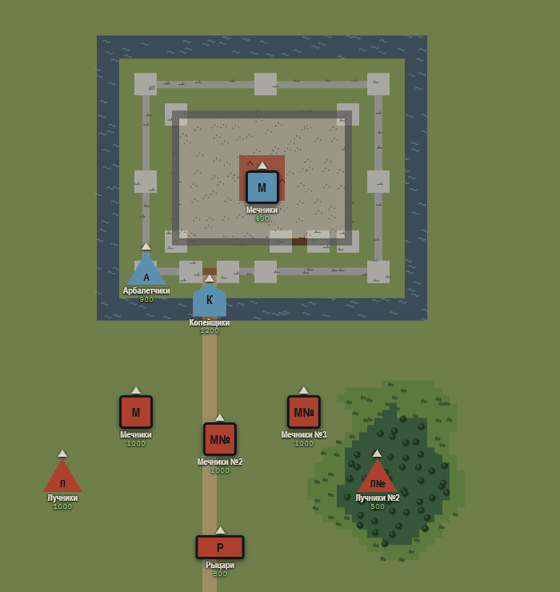
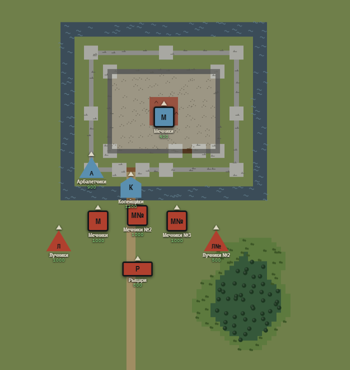
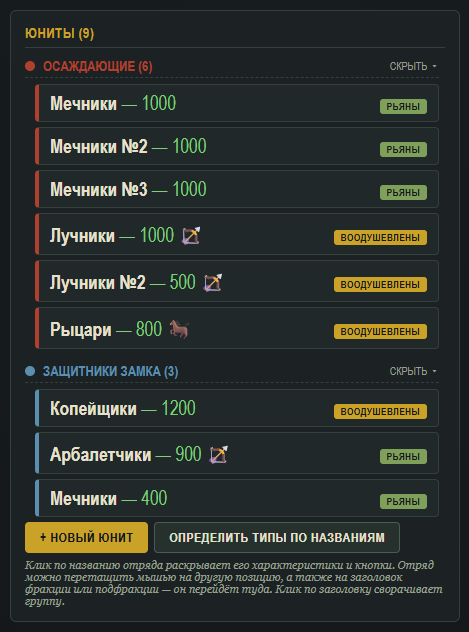
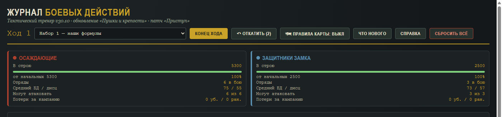
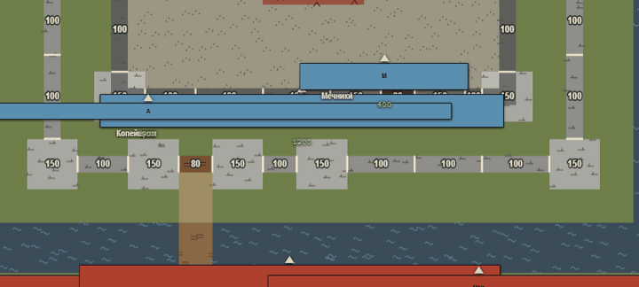
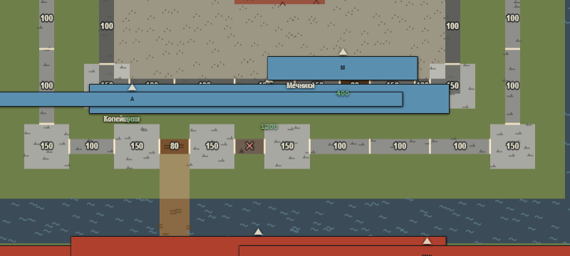
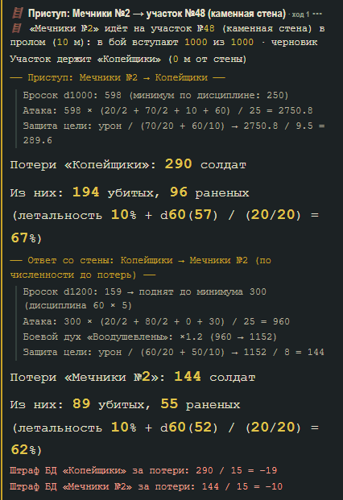

# Журнал боевых действий

Трекер для настольных сражений кампании «Кодекса Альтера» и игра на его основе. План — в `SPEC.md`, правила работы — в `CLAUDE.md`.

## Как это выглядит

Трекер v30.10 «Приступ»: осада концентрического замка — карта в метрах, фишки с типом войск и строем, армии из текста отчёта о битве.



| Карта боя | Армии и сводка |
|---|---|
|  |  |



### Штурм: стены, пролом, приступ

Участки стен держат удар (прочность — числом на карте), краснеют от урона и рушатся. После пролома отряд идёт на стену в пролом или по лестницам — бой считается по формулам с высотой, ответом защитников и потерями.



| Пролом в стене | Приступ в пролом: запись журнала |
|---|---|
|  |  |

## Что где

```
tracker/   трекер для ГМа: один HTML-файл, движок правил на JavaScript (см. tracker/README.md)
core/      движок правил на C# для игры: те же правила, без Unity (локальный пакет Unity + тесты на .NET 10)
game/      игра на Unity — одновременные ходы, живые фигурки солдат (Г1–Г23 в SPEC)
shared/    общее для обеих реализаций:
  golden/    эталон v29 (golden.json), замороженные сценарии (scenarios.json) и сценарии карты (map.json: 6а, участки стен, орудия), шаблоны отрядов (templates.json)
  siege/     каталог осадных орудий для ГМа (catalog.md — собирается node tracker/tools/siege-report.mjs)
  battles/   отчёты о битвах из «Кодекса Альтера» без правок — образцы для сбора армий
```

## Одни правила — две реализации

Трекер (JavaScript) и игра (C#) считают бой по одним правилам. Судья — общие сценарии в `shared/`: 400 сценариев эталона v29 обе реализации обязаны отыграть строка в строку, а сценарии карты (генераторы, местность, путь, паника) — бит в бит. Правило меняется в обеих сразу, одним коммитом.

## Проверка

```
cd tracker && npm install && npm run check
cd core && dotnet run --project Tests
```
